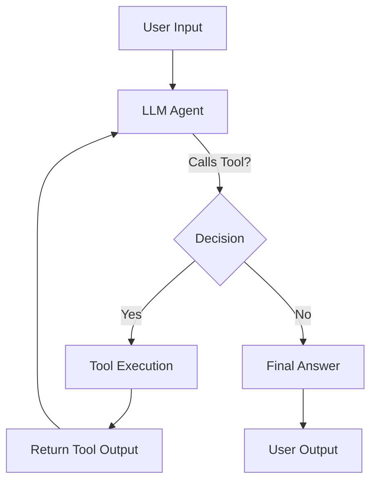

#  Simple Agentic AI Boilerplate

This repository provides a **minimal boilerplate** to help you get started with building **agentic AI applications** using [LangGraph](https://github.com/langchain-ai/langgraph), [LangChain](https://www.langchain.com/), and [OpenAI models](https://platform.openai.com/).

It demonstrates how to set up an **agent loop** where an LLM can:

* Take user input
* Decide whether to respond directly or call a tool
* Use external tools (e.g., calculator, web search)
* Return the final answer to the user

The included example agent comes with:

* 🔢 **Calculator Tool** → evaluates basic math expressions
* 🌍 **Web Search Tool** → searches the web via DuckDuckGo

---

## ✨ Why this repo?

The goal is to provide a **clean, lightweight starting point** for developers who want to explore:

* Building **agent workflows**
* Connecting **LLMs with tools**
* Creating **state-based AI systems** with LangGraph

This is **not production-ready** — it’s meant as a **learning and prototyping boilerplate**.

---

## 🚀 Getting Started

1. **Clone the repo**

   ```bash
   git clone https://github.com/yourusername/simple-agentic-ai.git
   cd simple-agentic-ai
   ```

2. **Install dependencies**

   ```bash
   pip install -r requirements.txt
   ```

3. **Set your environment variables**
   Make sure you have an OpenAI API key available:

   ```bash
   export OPENAI_API_KEY=your_key_here
   ```

4. **Run the agent**

   ```bash
   python simple_agentic_ai.py
   ```

---

## 💬 Example Interaction

```
You: What is 15 * 12?
Agent: 180
```

```
You: Search for latest AI news
Agent: [Web search results...]
```

---

## 🔧 How to Extend

This boilerplate is designed to be **easily extensible**. Here are some ways you can expand it:

### 1. Add New Tools

Create a new tool function and register it with the model.

```python
def weather_tool(city: str):
    return {"forecast": f"Sunny in {city}"}
```

Then bind it in the `model.bind_tools([...])` section.

---

### 2. Swap Models

Replace `gpt-4o-mini` with any other OpenAI or local model.

```python
model = ChatOpenAI(model="gpt-4.1", temperature=0)
```

---

### 3. Add Memory

Right now, the agent only remembers the current conversation loop.
To persist context across turns:

* Use LangChain’s memory components
* Or store state in a database / vector store

---

### 4. Modify the Workflow

The `StateGraph` defines how the agent loops between LLM and tools.
You can:

* Add conditional edges for custom logic
* Chain multiple tools
* Run parallel tasks

---

### 5. Connect to Your APIs

Replace or extend tools with **custom APIs**, e.g.:

* Hotel booking system
* Internal knowledge base
* Product search
* IoT or business process automation

---

## 🧩 Workflow Diagram

Here’s how the agent loop works:



---

## ⚠️ Disclaimer

* The `calculator_tool` uses Python’s `eval()` — **not safe for untrusted input**. Replace it with a safer evaluator in production.
* This is a **toy example** meant for learning and experimentation.


